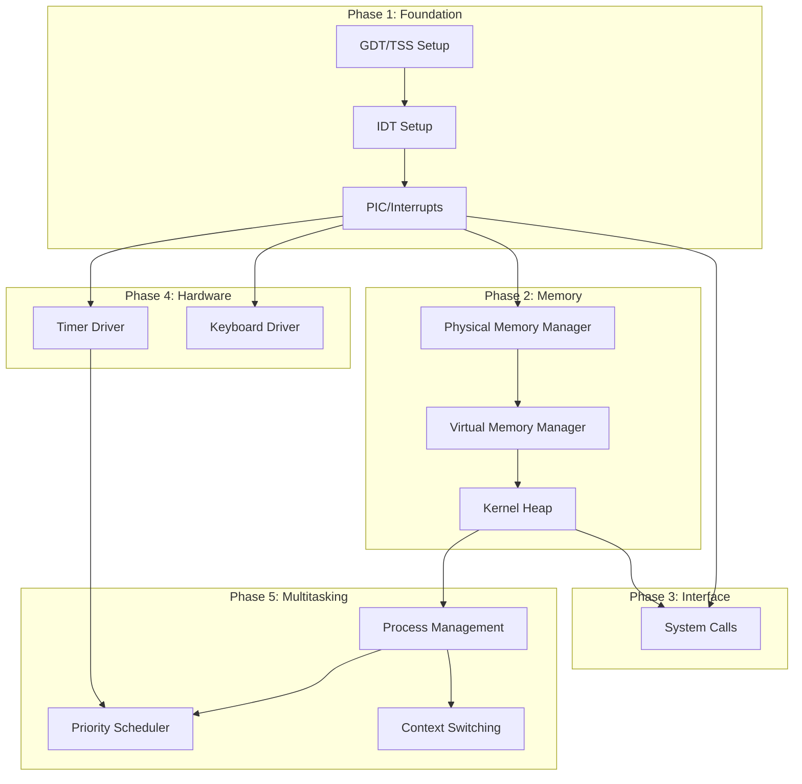

# Kernel Core Features Implementation Plan

## Architecture Overview

The five subsystems have clear dependencies that dictate implementation order:



## Project Structure

New files to create in `kernel/`:

```
kernel/
├── cpu/
│   ├── gdt.c / gdt.h       # Global Descriptor Table + TSS
│   ├── idt.c / idt.h       # Interrupt Descriptor Table
│   ├── isr.S               # Interrupt service routine stubs (asm)
│   └── pic.c / pic.h       # 8259 PIC driver
├── mm/
│   ├── pmm.c / pmm.h       # Physical memory manager (bitmap)
│   ├── vmm.c / vmm.h       # Virtual memory / paging
│   └── heap.c / heap.h     # Kernel heap allocator
├── syscall/
│   ├── syscall.c / syscall.h   # SYSCALL/SYSRET handler
│   └── syscall_table.c         # System call implementations
├── drivers/
│   ├── timer.c / timer.h   # PIT timer driver
│   └── keyboard.c / keyboard.h  # PS/2 keyboard driver
├── proc/
│   ├── process.c / process.h   # Process structures (PCB)
│   ├── scheduler.c / scheduler.h # Priority scheduler
│   └── context.S           # Context switch (asm)
└── (existing files)
```

---

## Phase 1: Interrupt Handling

### 1.1 GDT and TSS Setup

The GDT must define kernel/user code and data segments plus a TSS for ring transitions.

**Key structures:**

```c
// 64-bit GDT entry
typedef struct {
    uint16_t limit_low;
    uint16_t base_low;
    uint8_t  base_mid;
    uint8_t  access;
    uint8_t  granularity;
    uint8_t  base_high;
} __attribute__((packed)) gdt_entry_t;

// TSS for x86_64 (holds RSP0 for ring 3->0 transitions)
typedef struct {
    uint32_t reserved0;
    uint64_t rsp0;      // Stack for ring 0
    uint64_t rsp1;
    uint64_t rsp2;
    // ... IST entries, I/O bitmap
} __attribute__((packed)) tss_t;
```

**GDT layout:**

- Entry 0: Null descriptor
- Entry 1: Kernel code (0x00, DPL=0)
- Entry 2: Kernel data (0x00, DPL=0)
- Entry 3: User code (0x00, DPL=3)
- Entry 4: User data (0x00, DPL=3)
- Entry 5-6: TSS (16 bytes, spans two entries)

### 1.2 IDT Setup

256-entry Interrupt Descriptor Table for exceptions, IRQs, and syscalls.

**Key entries:**

- 0-31: CPU exceptions (divide error, page fault, etc.)
- 32-47: Hardware IRQs (remapped PIC)
- 128 (0x80): Legacy syscall interrupt (optional)

**IDT entry (64-bit):**

```c
typedef struct {
    uint16_t offset_low;
    uint16_t selector;
    uint8_t  ist;           // Interrupt Stack Table
    uint8_t  type_attr;     // Present, DPL, type (interrupt/trap gate)
    uint16_t offset_mid;
    uint32_t offset_high;
    uint32_t reserved;
} __attribute__((packed)) idt_entry_t;
```

### 1.3 ISR Stubs

Assembly stubs that save registers, call C handler, restore, and `iretq`:

```asm
// isr.S - example stub
isr_common:
    push rax, rbx, ... r15    // Save all GPRs
    mov rdi, rsp              // Pass pointer to saved state
    call interrupt_handler     // C handler
    pop r15, ... rax          // Restore
    iretq
```

### 1.4 PIC Initialization

Remap 8259 PIC to avoid conflicts with CPU exceptions:

- Master PIC: IRQ 0-7 -> INT 32-39
- Slave PIC: IRQ 8-15 -> INT 40-47

---

## Phase 2: Memory Management

### 2.1 Physical Memory Manager

**Approach:** Bitmap allocator (1 bit per 4KB page)

**Key functions:**

```c
void pmm_init(memory_map_entry_t *mmap, uint64_t entries);
void *pmm_alloc_page(void);       // Returns physical address
void pmm_free_page(void *addr);
void *pmm_alloc_pages(size_t count);  // Contiguous pages
```

**Implementation notes:**

- Parse UEFI memory map from `boot_info`
- Mark kernel region, framebuffer, MMIO as used
- Bitmap stored in kernel BSS (or first available memory)
- For 4GB RAM: bitmap = 128KB

### 2.2 Virtual Memory Manager

**Approach:** 4-level page tables (PML4 -> PDPT -> PD -> PT)

**Key functions:**

```c
void vmm_init(void);
void vmm_map_page(uint64_t virt, uint64_t phys, uint64_t flags);
void vmm_unmap_page(uint64_t virt);
uint64_t vmm_get_physical(uint64_t virt);
pml4_t *vmm_create_address_space(void);  // For new processes
```

**Memory layout:**

```
0x0000000000000000 - 0x00007FFFFFFFFFFF  User space (128TB)
0xFFFF800000000000 - 0xFFFFFFFFFFFFFFFF  Kernel space (128TB)
  0xFFFF800000000000  Physical memory direct map
  0xFFFFFFFF80000000  Kernel code/data (higher-half)
```

### 2.3 Kernel Heap

**Approach:** Simple first-fit allocator with coalescing

**Key functions:**

```c
void heap_init(void *start, size_t size);
void *kmalloc(size_t size);
void *kmalloc_aligned(size_t size, size_t align);
void kfree(void *ptr);
```

---

## Phase 3: System Calls (SYSCALL/SYSRET)

### 3.1 MSR Configuration

Enable SYSCALL by writing to MSRs:

- `IA32_EFER` (0xC0000080): Set SCE bit
- `IA32_STAR` (0xC0000081): Segment selectors
- `IA32_LSTAR` (0xC0000082): Syscall entry point
- `IA32_FMASK` (0xC0000084): RFLAGS mask

### 3.2 Syscall Entry

```asm
syscall_entry:
    swapgs                    // Get kernel GS (for per-CPU data)
    mov [gs:user_rsp], rsp    // Save user stack
    mov rsp, [gs:kernel_rsp]  // Load kernel stack
    push rcx                  // User RIP
    push r11                  // User RFLAGS
    // Save other registers...
    call syscall_dispatch     // RAX = syscall number
    // Restore...
    sysretq
```

### 3.3 Initial Syscalls

| Number | Name | Description |

|--------|------|-------------|

| 0 | sys_read | Read from file descriptor |

| 1 | sys_write | Write to file descriptor |

| 2 | sys_exit | Terminate process |

| 3 | sys_yield | Yield CPU to scheduler |

| 4 | sys_sleep | Sleep for milliseconds |

| 5 | sys_getpid | Get process ID |

---

## Phase 4: Device Drivers

### 4.1 Timer Driver (PIT)

**PIT configuration:**

- Channel 0, Mode 2 (rate generator)
- Frequency: 100 Hz (10ms ticks) for scheduler

**Key functions:**

```c
void timer_init(uint32_t frequency);
uint64_t timer_get_ticks(void);
void timer_handler(void);  // Called from IRQ0
```

### 4.2 Keyboard Driver (PS/2)

**Features:**

- Scancode set 1 translation
- Key buffer (ring buffer)
- Modifier tracking (Shift, Ctrl, Alt)

**Key functions:**

```c
void keyboard_init(void);
char keyboard_getchar(void);      // Blocking
int keyboard_read(char *buf, size_t n);  // Non-blocking
void keyboard_handler(void);      // Called from IRQ1
```

---

## Phase 5: CPU Scheduling

### 5.1 Process Control Block (PCB)

```c
typedef enum {
    PROC_READY,
    PROC_RUNNING,
    PROC_BLOCKED,
    PROC_ZOMBIE
} proc_state_t;

typedef struct process {
    uint64_t pid;
    proc_state_t state;
    int priority;           // 0 (highest) to 31 (lowest)
    
    // CPU state
    uint64_t rsp;           // Saved stack pointer
    uint64_t rip;           // Saved instruction pointer
    cpu_state_t *context;   // All saved registers
    
    // Memory
    pml4_t *page_table;     // Process address space
    uint64_t kernel_stack;  // Per-process kernel stack
    
    // Scheduling
    uint64_t time_slice;    // Remaining time in ticks
    uint64_t total_time;    // Total CPU time used
    
    struct process *next;   // For ready queue
} process_t;
```

### 5.2 Priority Scheduler

**Design:**

- 32 priority levels (0 = highest)
- Ready queue per priority level
- Always run highest-priority ready process
- Time slices based on priority (higher priority = longer slice)
```c
void scheduler_init(void);
void schedule(void);              // Called from timer interrupt
void scheduler_add(process_t *p);
void scheduler_block(process_t *p);
void scheduler_unblock(process_t *p);
process_t *scheduler_current(void);
```


### 5.3 Context Switching

Assembly routine to switch between processes:

```asm
// context_switch(old_context, new_context)
context_switch:
    // Save current context to old_context
    push rbp, rbx, r12-r15
    mov [rdi], rsp
    
    // Load new context
    mov rsp, [rsi]
    pop r15-r12, rbx, rbp
    ret
```

---

## Implementation Order

1. **GDT/TSS** - Foundation for protected mode segments
2. **PIC** - Remap interrupts before enabling IDT
3. **IDT + ISRs** - Enable interrupt handling
4. **Timer driver** - Get timer ticks working
5. **PMM** - Physical page allocation
6. **VMM** - Page table management
7. **Kernel heap** - Dynamic memory allocation
8. **Keyboard driver** - Input for testing
9. **Process structures** - PCB definition
10. **Context switching** - Switch between tasks
11. **Priority scheduler** - Task scheduling
12. **SYSCALL/SYSRET** - User-mode system calls

---

## Testing Strategy

After each phase:

- **Phase 1:** Trigger exceptions, verify handlers run
- **Phase 2:** Allocate/free pages, verify mappings
- **Phase 3:** User-mode program calls `sys_write` to print
- **Phase 4:** Timer shows tick count, keyboard echoes input
- **Phase 5:** Create two processes, watch them alternate

---

## Files to Modify

- [kernel/kernel.c](kernel/kernel.c): Add initialization calls for each subsystem
- [kernel/entry.S](kernel/entry.S): Jump to new GDT setup before kernel_main
- [kernel/kernel.ld](kernel/kernel.ld): Add sections for new code/data
- [kernel/Makefile](kernel/Makefile): Add new source files