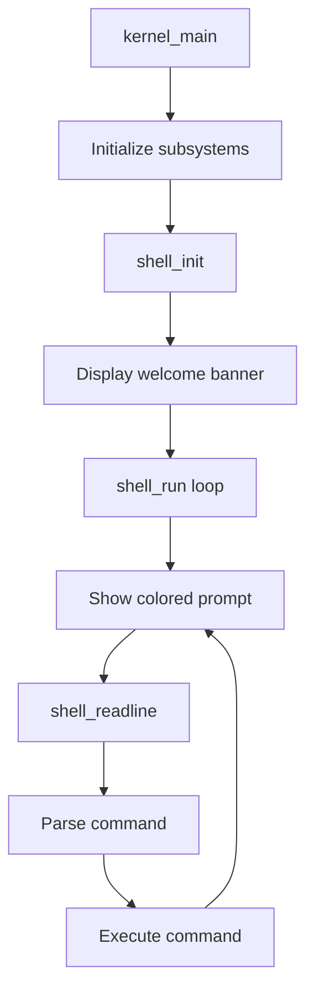

# SimpleOS Shell Implementation

## Architecture

The shell will be a new kernel module that runs as the main interactive interface after kernel initialization.



## New Files

### Shell Module: `kernel/shell/`

- **[shell.h](kernel/shell/shell.h)** - Shell interface and constants
- **[shell.c](kernel/shell/shell.c)** - Main shell implementation:
  - `shell_init()` - Initialize shell state
  - `shell_run()` - Main shell loop
  - `shell_readline()` - Read line with editing support
  - Command dispatcher and built-in command handlers
- **[history.h](kernel/shell/history.h)** / **[history.c](kernel/shell/history.c)** - Command history with up/down arrow navigation

## Built-in Commands

| Command | Description |

|---------|-------------|

| `help` | List all commands with descriptions |

| `clear` | Clear the screen |

| `echo [text]` | Print text to console |

| `version` | Show SimpleOS version info |

| `uptime` | Display system uptime (from timer ticks) |

| `meminfo` | Show memory statistics (free pages, heap usage) |

| `ps` | List running processes |

| `hexdump [addr] [len]` | Dump memory in hex format |

| `reboot` | Reboot the system |

## Key Features

### Line Editing

- Backspace to delete characters (already supported in console)
- Enter to submit command
- Up/Down arrows for history navigation
- Input buffer with max length (128 chars)

### Command History

- Store last 16 commands in a circular buffer
- Navigate with arrow keys (requires extending keyboard driver for arrow scancodes)

### Visual Style

- **Welcome banner**: Colorful ASCII art or styled header
- **Prompt**: Colored `simpleos> ` in cyan/green
- **Output**: Color-coded by command type (info in white, success in green, errors in red)

## Code Changes

### 1. Keyboard Driver Enhancement ([keyboard.c](kernel/drivers/keyboard.c))

Add arrow key scancode detection. The scancodes are:

- Up: `0x48` (extended)
- Down: `0x50` (extended)
- Left: `0x4B` (extended)  
- Right: `0x4D` (extended)

Return special codes for arrow keys that the shell can detect.

### 2. Kernel Main ([kernel.c](kernel/kernel.c))

Replace the keyboard echo loop at the end of `kernel_main` with:

```c
#include "shell/shell.h"
// ... after init phases ...
shell_init();
shell_run();  // Never returns
```

### 3. Console Enhancement

Add `console_clear()` function for the `clear` command.

### 4. Makefile Update ([kernel/Makefile](kernel/Makefile))

Add shell sources to the build:

```makefile
SHELL_SRCS = shell/shell.c shell/history.c
```

## Implementation Order

1. Create shell module skeleton with basic prompt loop
2. Implement `help`, `clear`, `echo`, `version` commands
3. Add `uptime`, `meminfo`, `ps` commands (use existing kernel APIs)
4. Implement command history
5. Extend keyboard driver for arrow keys
6. Add `hexdump` and `reboot` commands
7. Polish: welcome banner, colors, error handling